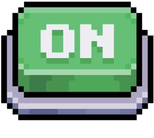
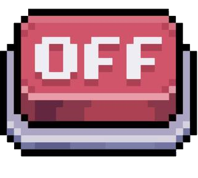

# **Project python**
*Groupe n°15 : MACE Léo, DERONNE Mathis, VIGUIE Lorens*  

## Prérequis 
**[🐍Python v3.10](https://www.python.org/downloads/) [📚Ursina](https://www.ursinaengine.org) [📚Numpy](https://numpy.org)**

# Duck.exe

Duck.exe est un jeu dans lequel vous incarnerez un canard qui a pour objectif de récupérer un coffre au trésor.
Pour ce faire vous devrez parcourir un monde remplis de monstres pouvant vous tuer en seulement quelques attaques alors faites bien attention à vous.

Dans ce jeu vous allez avoir la possibilité de choisir une classe parmis les 3 classes suivante :
- **Mage :** Grâce à leur magie, les canards mages réduisent de 20% les dommages qu'ils subissent.
- **Warrior :** Grâce à leur musculatures imposante, les canards warriors augmentent leur puissance d'attaque de 3 unités.
- **Thief :** Grâce à leurs armes spécialisées pour les missions discrètes, les carnards Thiefs voient leurs attaques ignorer la défense de leurs adversaires.

Mais faites attention et observez bien votre environnement, celui-ci pourrait bien cacher quelques secrets.
Comme nous sommes gentils, nous acceptons humblement de vous présenter quelques spécificités présentes dans l'environnement de Duck.exe.

### **Des sols cassables :** 


Ces sols ont la faculté de pouvoir être détruit en quelques coups de bec, ils pourraient bien bloquer l'accès à quelques chemins intéressants.

### **Des boutons :**




Des boutons pouvant être activés sont cachés dans l'environnement, l'activation de certains d'entre eux seront peut-être nécessaire pour atteindre le trésor tant convoité.

### **Des zones activables :**


Ces zones semblent être alimentées par quelque chose, il doit sûrement être possible de couper leur alimentation, qui sait, il se passera peut-être quelque chose.

### **Des points de régénération :**


Les combats vont sûrement vous fatiguer ou bien vous blesser, des points de régénération sont présent afin de vous soigner un peu.

### **Le trésor :**


Vous ne vous aventurez pas dans le danger pour aucunes raison. La raison la voici, un magnifique coffre au trésor, source d'envie.

<br>
<br>

> ***Toutes les manières sont bonnes pour atteindre son objectif, mais se battre n'est pas forcément la meilleure d'entre elles.***

<br>
<br>
<br>

## Fonctionnalités :

<br>

```
- Déplacements horizontaux|verticaux

- Système de gravité

- Gestion des collisions

- Interractions avec l'environnement

- Système de combat

- Gestion de classes

- Gestion de la vie du personnage

- Apparition de la map en suivant l'avancé du joueur

- Système d'activation des trait de vision des monstres|joueur via une variable

- Système de visualisation de la carte via un variable
```